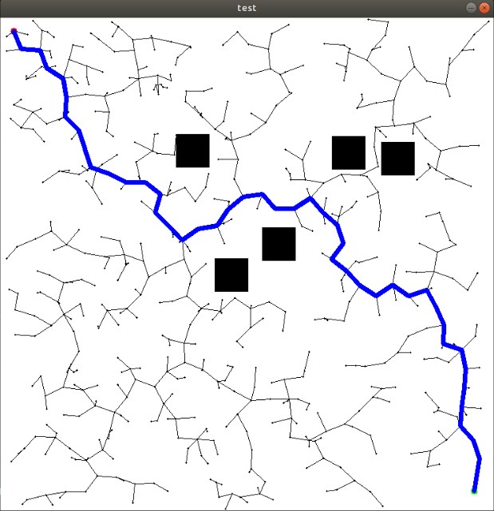

# RRT-Cpp
C++ implementation of Rapidly-Exploring Random Trees(RRT), a path planning algorithm.

The algorithm has been visualized using the OpenCV library.

https://www.youtube.com/watch?v=qg2uqpyo0Xs

